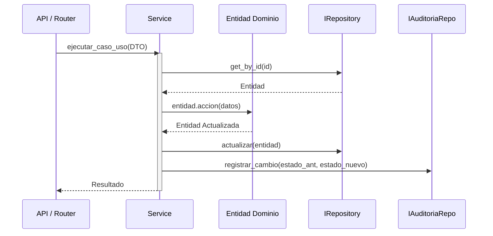

# Capa de Servicios (Application Services)

La capa de servicios (`src/services/`) representa los **Casos de Uso** de la aplicación ZECI Manager v2.0. Actúa como el orquestador principal del sistema, coordinando la lógica de negocio, validando permisos y restricciones, y sirviendo como puente absoluto entre la capa de presentación (API/Controladores) y los modelos de dominio.

## Principios de Diseño

De acuerdo con la Arquitectura Limpia adoptada por el proyecto, los servicios siguen estos principios estrictos:

1. **Agnósticos a la Infraestructura:** No contienen sentencias SQL ni conocen detalles de la base de datos subyacente. Toda persistencia se realiza a través de interfaces (puertos) inyectadas (ej. `IUsuarioRepository`).
2. **Agnósticos a la Presentación:** No manejan objetos HTTP (`Request`/`Response`) ni excepciones propias de FastAPI. Reciben Primitivos/DTOs Pydantic y retornan Modelos de Dominio.
3. **Orquestación Pura:** La lógica intrínseca, cambios de estado y transiciones (ej. aprobar una materia) le pertenece a las Entidades de Dominio. El servicio orquesta los pasos: Buscar -> Llamar Entidad -> Persistir -> Auditar.

---

## Interacción Arquitectónica

El siguiente flujo demuestra la anatomía de una operación típica dentro de cualquier servicio del sistema:



---

## Servicios Principales y sus Responsabilidades

El núcleo de la aplicación está compuesto por **23 servicios funcionales** altamente cohesivos. 

### 1. `CierreService`
Es el corazón académico del sistema y el servicio más complejo.
- **Cierre de Periodo:** Valida que el periodo esté formalmente abierto. Para cada estudiante, consolida sus notas de la asignatura y delega a `CalculadorNotas.calcular_definitiva()`. Determina su `NivelDesempeno` y, si la nota es baja, dispara automáticamente una alerta de riesgo hacia el `AlertaService`.
- **Cierre Anual:** Se asegura de que todos los periodos del año estén cerrados. Promedia todas las calificaciones ponderadas. Detecta si hubo un examen de habilitación y lo promedia. Determina si la materia fue definitivamente aprobada o perdida.
- **Decisiones de Promoción:** Administra el dictamen final para determinar si un estudiante cambia de grado (Pasa de `PENDIENTE` a `PROMOVIDO`, `REPROBADO` o `CONDICIONAL`).

### 2. `EvaluacionService`
Maneja el día a día de las calificaciones del docente.
- **Validaciones Críticas:**
  - Garantiza que la suma de los "pesos porcentuales" de las categorías evaluativas de un periodo no exceda nunca el **100% (1.0)**.
  - Asegura que las notas numéricas solo puedan registrarse sobre actividades cuyo estado actual sea `PUBLICADA` (rechazando las de estado `BORRADOR` o `CERRADA`).
- **Live Calculation:** Es capaz de devolver una planilla entera con los promedios calculados al vuelo sin necesidad de haber cerrado el periodo.

### 3. `AsistenciaService` y `ConvivenciaService`
Servicios gemelos enfocados en la disciplina y la asistencia, con integraciones reactivas.
- **Alertas Automáticas:** Al procesar inasistencias o llamados de atención, consultan la configuración institucional. Si las faltas `INJUSTIFICADAS` o los llamados de atención superan el umbral permitido (ej. más de 5 faltas), instancian un objeto de la entidad `Alerta` de nivel `ADVERTENCIA` o `CRITICA` y lo insertan sin intervención del docente.
- **Trazabilidad:** `ConvivenciaService` permite hacer seguimiento narrativo a cada evento disciplinario y dejar constancia de la notificación al acudiente.

### 4. `AlertaService`
Central de gestión de alertas institucionales.
- Define dinámicamente las configuraciones anuales de umbrales.
- Expone el método `detectar_riesgo_academico()` que realiza un barrido masivo identificando estudiantes con múltiples materias perdidas simultáneamente.

### 5. `EstadisticosService` e `InformeService`
La dupla dedicada a extraer y presentar información (Business Intelligence interno).
- **`EstadisticosService`:** Es de Solo Lectura. Delega las agrupaciones pesadas a queries optimizadas en su repositorio. Calcula promedios generales por grupo, distribución de estudiantes por desempeños, rankings y promedios por área de conocimiento.
- **`InformeService`:** No accede directamente a BD. Toma los consolidados del `EstadisticosService` y se los inyecta a un `IExporterService` (exportadores Excel/PDF desconectados del framework) para entregar un archivo binario descargable (boletines, actas).

### 6. `HabilitacionService`
Control de procesos de recuperación.
- Permite programar exámenes de nivelación para estudiantes que reprobaron asignaturas anuales.
- Determina autónomamente la aprobación del examen evaluando la calificación frente a la configuración `nota_minima_habilitacion` de la institución.

### 14. `NivelacionService` *(Nuevo — Junio 2026)*
Gestión del proceso post-cierre de período establecido por Decreto 1290.
- Crea y valida actividades de nivelación por asignación+periodo (cada actividad tiene peso; la suma debe ser 1.0 para poder cerrar).
- Gestiona la calificación por estudiante (upsert de `NotaNivelacion`).
- Cierra la nivelación emitiendo un `CierreNivelacion` — inmutable una vez cerrado.
- Delega el cálculo de la nota definitiva al `CalculadorNivelacion`, que no almacena el valor calculado.
- Solo acepta nivelaciones para asignaciones con `CierrePeriodo` existente.

### 15. `PlanMejoramientoService` *(Nuevo — Junio 2026)*
Gestión del plan de mejoramiento cuantitativo (distinto del plan narrativo de `HabilitacionService`).
- **Ejecutar corte:** Calcula la nota al corte de cada estudiante de la asignación usando las notas existentes en `EvaluacionService`. Determina quién va al plan (nota < umbral proporcional).
- **Actividades del plan:** CRUD de `ActividadPlan` con validación de suma de pesos ≤ 1.0.
- **Notas del plan:** Calificación por estudiante en cada actividad.
- **Cierre por estudiante:** Marca `APROBADO` o `REPROBADO` y congela la `nota_definitiva_plan`.

### 16. `InfraestructuraService` *(Nuevo — Junio 2026)*
Administrador de la topología escolar (CRUD de entidades base).
- Gestiona `AreaConocimiento`, `Asignatura`, `Grupo`, `Grado`, `Sala`.
- Valida integridad referencial antes de eliminar (avisa si hay asignaciones vinculadas).

### 17. `PlanEstudiosService` *(Nuevo — Junio 2026)*
Gestiona la relación `Grado → Asignatura → horas_semanales`.
- Permite definir cuántas horas semanales tiene cada asignatura por grado.
- Usa un `asignacion_svc_provider` callable para obtener las asignaciones existentes sin crear dependencia circular.
- Valida que las horas del plan de estudios sean coherentes con las asignaciones activas.

### 18. `PreparacionHorarioService` *(Nuevo — Junio 2026)*
Construye el contexto de preparación necesario antes de generar horarios.
- Gestiona `PlantillaFranja` y `Franja` (la rejilla de franjas horarias).
- Gestiona `EscenarioHorario` (contenedor de una versión del horario maestro).
- Gestiona `DisponibilidadDocente` (restricciones de disponibilidad por docente).
- Gestiona `ConfigGeneracion` (parámetros y pesos para el algoritmo generador).
- Expone `VentanaGrupo`, `BloqueAnclado`, `FranjaReunion`, `LimitesDocente` como restricciones de generación.

### 19. `HorarioService` *(Nuevo — Junio 2026)*
CRUD de bloques horarios dentro de un escenario.
- Inserta, actualiza y elimina bloques horarios con validación de conflictos (`existe_cruce`).
- Valida que el docente no tenga otro bloque solapado en la misma franja (mismo escenario).
- Expone las vistas enriquecidas (`HorarioInfo`) para los grids de la UI.

### 20. `GeneradorHorarioService` *(Nuevo — Junio 2026)*
Genera automáticamente la grilla completa de horarios para un periodo.
- Lee la `ConfigGeneracion` activa (pesos para la función objetivo: distribución, respeto de disponibilidad, cumplimiento de horas).
- Itera por grupos y asignaturas del plan de estudios para asignar bloques a franjas disponibles.
- Respeta las restricciones: `DisponibilidadDocente`, `VentanaGrupo`, `BloqueAnclado`, `FranjaReunion`, `LimitesDocente`.
- Escribe los bloques generados en el `EscenarioHorario` destino indicado en la config.
- Retorna `ResultadoGeneracionDTO` con los bloques y `MetricasCalidadDTO` para evaluación del resultado.

### 7. `EstudianteService` y `UsuarioService`
Manejo de Actores.
- **`EstudianteService`:** Matriculación, retiros de la institución y sincronización del flag de inclusión `posee_piar` al crear registros para estudiantes con necesidades especiales (PIAR).
- **`UsuarioService`:** Control de acceso, perfiles de roles, y comunicación con el puerto `IAuthenticationService` (que oculta los detalles de encriptación y hashes `bcrypt` al dominio principal).

### 8. `AcudienteService`
Vinculación de responsables legales (padres, madres o tutores) a los estudiantes.
- Gestiona la información de contacto esencial para notificaciones.
- Permite designar un acudiente principal para las comunicaciones críticas e informes.

### 9. `AsignacionService`
Core de la relación Docente-Asignatura-Grupo. 
- Determina qué profesor dicta qué materia y a quién. Es el pivote de validación cuando un docente intenta registrar notas o asistencia (solo puede hacerlo para sus asignaciones activas).

### 10. `AuditoriaService`
El vigilante silencioso del sistema.
- Expone métodos para registrar trazas de eventos y cambios de estado profundos. 
- Actúa de forma pasiva y es consumido transversalmente por los demás servicios mediante el método protegido `_auditar()`.

### 11. `ConfiguracionService`
Maneja el estado paramétrico global e institucional.
- Gestiona el número de periodos del año.
- Define el Sistema Institucional de Evaluación (escala valorativa, umbrales de aprobación, nota mínima de habilitación), sirviendo de fuente de verdad para los cálculos matemáticos de otros servicios.

### 12. `InfraestructuraService`
Administrador de la topología escolar.
- Gestiona la creación de Áreas de Conocimiento, Asignaturas, Grados y Grupos.
- Controla y valida el módulo de horarios para evitar conflictos (ej. un docente programado en dos grupos a la vez).

### 13. `PeriodoService`
Ciclo de vida del tiempo académico.
- Controla el estado `ACTIVO`, `CERRADO` o `FUTURO` de los lapsos lectivos del año escolar.
- Sus transiciones bloquean o permiten de forma absoluta la escritura de nuevas calificaciones a nivel de todo el colegio.

---

## Trazabilidad y Auditoría (Cross-cutting concern)

Una característica vital de la capa de Servicios de ZECI Manager v2.0 es su trazabilidad invisible. Todos los métodos que causan mutaciones invocan el método protegido `_auditar()`.

```python
def _auditar(
    self,
    accion: AccionCambio, # CREATE, UPDATE, DELETE
    tabla: str,
    registro_id: int | None,
    datos_ant: dict | None,
    datos_nue: dict | None,
    usuario_id: int | None,
) -> None:
    # Registra qué campo cambió de qué valor anterior a qué valor nuevo
    ...
```

Esta inyección de la interfaz `IAuditoriaRepository` garantiza:
1. **Historial Completo:** Se pueden rastrear modificaciones de notas hechas de forma retroactiva.
2. **Desacoplamiento:** Los modelos de negocio puros no necesitan llenarse de atributos `created_at` o lógicas de log. 
3. **Facilidad de Testing:** En pruebas unitarias, se puede inyectar un repositorio simulado (Mock) sin afectar la evaluación de la regla de negocio.
